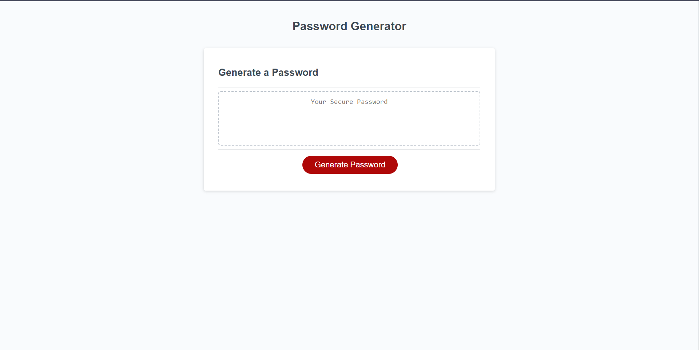

# 03 JavaScript: Password Generator

## User Story

```
AS AN new developer
I WANT to invoke new skills learned by developing a password generator
SO THAT I can create a strong password that provides greater security
```

## Acceptance Criteria

```
GIVEN a user needs a secure password
WHEN a user clicks the button to generate a password
THEN a user is presented with a series of prompts for password criteria
WHEN prompted for password criteria
THEN a user select which criteria to include in the password
WHEN prompted for the length of the password
THEN a user choose a length of at least 8 characters and no more than 128 characters
WHEN asked for character types to include in the password
THEN a user confirm whether or not to include lowercase, uppercase, numeric, and/or special characters
WHEN a user answer each prompt
THEN my input should be validated and at least one character type should be selected
WHEN all prompts are answered
THEN a password is generated that matches the selected criteria
WHEN the password is generated
THEN the password is either displayed in an alert or written to the page
```

## Mock-Up

The following image shows the web application's appearance and functionality:




## Use
---
- Simply click the "Generate Password" button.
- you will be prompted by a windo alert for character length, use of upper/lower/special characters.
- Click okay to accept criteria or cancel to deny.
- If you deny all options you password will be generated using only numbers as a default.
---
